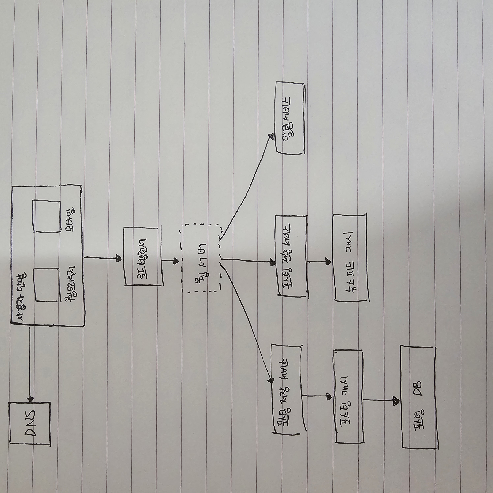
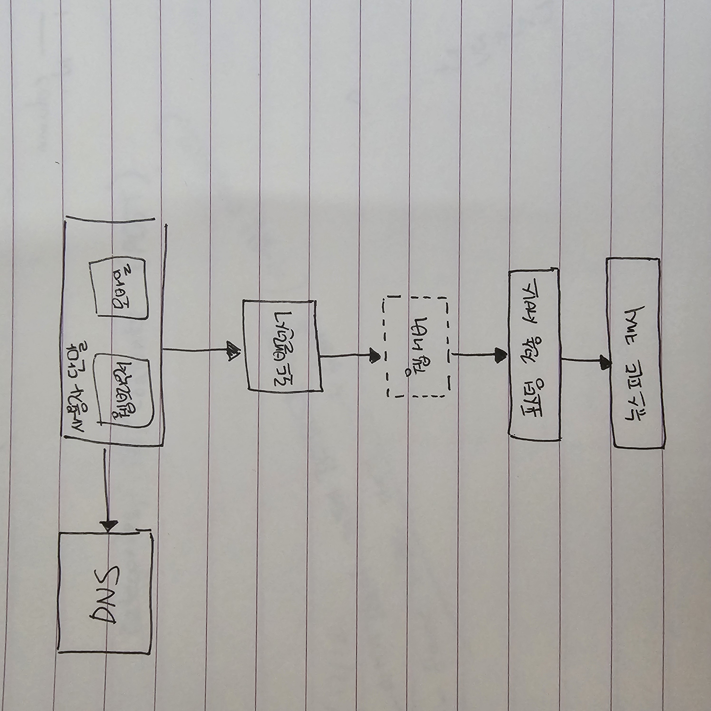

# 3장. 시스템 설계 면접 공략법

시스템 설계 면접은 당황스러울 때가 많다. <널리 알려진 제품 X를 설계해 보라> 는 식으로 막연한 문제가 나올 때도 있다. 면접장에서 수백 수천명의 엔지니어들이 참여하여 개발한 제품을 단시간에 설계를 할 수 있을 거라고 아무도 요구하지 않는다. 그럼 이런 설계 면접이 왜 있는 걸까?

> **시스템 설계 면접은 두 명의 동료가 모호한 문제를 풀기 위해 협력하여 그 해결책을 찾아내는 과정에 대한 시뮬레이션이다. 이 문제에는 정해진 결말도, 정답도 없다.**

시스템 설계 면접은 설계 기술을 시연하고, 설계 과정에서 내린 결정들에 대한 방어 능력을 보이는 자리이며, 면접관의 피드백을 건설적인 방식으로 처리할 자질이 있음을 보이는 자리이다.

면접관의 입장에서, 일차적인 목표는 면접자의 능력을 평가하는 것이고 가장 피하고 싶은 일은 면접이 매끄럽게 진행되지 않아서 충분한 시그널을 수집하지 못한 바람에 평가 결과를 확정 지을 수 없는 상황일 것이다.

시스템 설계 면접은 설계 능력의 기술적 측면 평가를 넘어 지원자가 협력에 적합한 사람인지, 압박이 심한 상황도 잘 헤처 나갈 자질이 있는지, 모호한 문제를 건설적으로 해결할 능력이 있는지, 좋은 질문을 던질 능력이 있는지 살펴보는 자리이다.

훌륭한 면접관은 부정적 신호도 놓치지 않는데, 설계의 순수성에 집착한 나머지 타협적 결정(trade-off)을 도외시하고 오버 엔지니어링을 하고 마는 엔지니어들을 파악하기도 한다.

## 3.1. 효과적 면접을 위한 4단계 접근법

시스템 설계 면접은 전부 제각각이고, 훌륭한 설계 면접은 정해진 결말도 없고 정답도 없다. 하지만 그 절차나 범위에는 공통적인 부분이 있다.

### 3.1.1. 문제 이해 및 설계 범위 확정

시스템 설계 면접을 볼 때는 생각 없이 바로 답을 내서는 좋은 점수를 받기 어렵다. (빠른 것이 좋은 것이 아니다.) 요구사항을 완전히 이해하지 않고 답을 내놓는 행위는 아주 엄청난 부정적 신호이다. 면접은 퀴즈 쇼가 아니며, 정답 따위는 없다는 것을 기억하자.

> 답부터 들이밀지 말라. 속도를 늦춰라. 깊이 생각하고 질문하여 요구사항과 가정들을 분명히 하라.

엔지니어가 가져야 할 가장 중요한 기술 중 하나는 올바른 질문을 하는 것, 적절한 가정을 하는 것, 그리고 시스템 구축에 필요한 정보를 모으는 것이다.

**면접관에게 질문할 것**

- 구체적으로 어떤 기능들을 만들어야 하나?
- 제품 사용자 수는 얼마나 되나?
- 회사의 규모는 얼마나 빨리 커지리라 예상하나? 석 달, 여섯 달, 일년 뒤의 규모는 얼마가 되리라 예상하는가?
- 회사가 주로 사용하는 기술 스택은 무엇인가? 설계를 단순화하기 위해 활용할 수 있는 기존 서비스로는 어떤 것들이 있는가?

#### 예제

뉴스피드 시스템을 설계하라는 요구를 받았다 해 보자. 요구사항을 분명히 하기 위해 질문을 던져야 할 것이다. 면접자와 면접관 사이에 오갈 대화는 다음과 비슷할 것이다.

> **지원자** : 모바일 앱과 웹 앱 가운데 어느 쪽을 지원해야 하나요? 아니면 둘 다 지원해야 하나요?
> **면접관** : 둘 다 지원해야 합니다.
> **지원자** : 가장 중요한 기능은 무엇인가요?
> **면접관** : 새로운 포스트를 올리고, 다른 친구의 뉴스 피드를 볼 수 있도록 하는 기능입니다.
> **지원자** : 이 뉴스 피드는 시간 역순으로 정렬되어야 하나요? 아니면 다른 특별한 정렬 기준이 있습니까? 제가 특별한 정렬 기준이 있느냐고 묻는 이유는, 피드에 올라갈 포스트마다 다른 가중치가 부여되어야 하는지 알고 싶어서 인데요. 가령 가까운 친구의 포스트가 사용자 그룹에 올라가는 포스트보다 더 중요하다거나요.
> **면접관** : 문제를 단순하게 만들기 위해, 일단 시간 역순으로 정렬된다고 가정합니다.
> **지원자** : 한 사용자는 최대 몇 명의 사용자와 친구를 맺을 수 있나요?
> **면접관** : 5000명입니다.
> **지원자** : 사이트로 들어오는 트래픽은 얼마나 되나요?
> **면접관** : DAU는 1000만명입니다.
> **지원자** : 피드에 이미지나 비디오도 올라올 수 있나요? 아니면 포스트는 그저 텍스트만 가능한가요?
> **면접관** : 이미지와 비디오 같은 미디어 파일도 포스트 할 수 있어야 합니다.

**요구사항을 이해하고 모호함을 없애는 게 이 단계에서 가장 중요하다.**

### 3.1.2. 개략적인 설계안 제시 및 동의 구하기

**이 단계에서는 개략적인 설계안을 제시하고 면접관의 동의를 얻는 것이다. 이 과정은 면접관과 협력하여 진행하면 좋다.**

- <u>설계안에 대한 최초 청사진을 제시하고 의견을 구하라.</u> 면접관을 마치 팀원인 것처럼 대하라.
- <u>화이트보드나 종이에 핵심 컴포넌트를 포함하는 다이어그램을 그려라.</u> 클라이언트(모바일/웹), API, 웹 서버, 데이터 저장소, 캐시, CDN, 메세지 큐 같은 것들이 포함될 수 있을 것이다.
- <u>이 최초 설계안이 시스템 규모에 관계된 제약사항을 만족하는지를 개략적으로 계산해보라.</u> 계산 과정은 소리 내어 설명하라. 이런 개략적 추정이 필요한지는 면접관에게 미리 물어보라.

이 단계에서 API endpoint 나 DB 스키마도 보여야 하는가? **상황에 따라 다르다.** 대규모 시스템을 설계할 때는 이 단계에서 다루기에는 지나치게 세부적인 내용일 수 있다. 하지만 작은 시스템을 설계할 때는 이 단계에서 API endpoint 나 DB 스키마를 보여주는 것이 좋을 수 있다. 면접관의 의견을 듣고 그에 따라 행동하라.

#### 예제

"뉴스 피드 시스템을 설계하라"는 질문을 그대로 활용하여, 개략적 설계를 어떻게 만들어야 하는지 살펴보자.

개략적으로 보자면 이 설계는 두 가지 처리 플로로 나누어 생각해 볼 수 있다.

  
### 피드 발행

<li>사용자가 포스트를 올리면 관련된 데이터가 캐시 / 데이터베이스 에 저장된다. 해당 사용자의 친구 뉴스 피드에 뜨게 된다. </li>

  
### 피드 생성

<li>어떤 사용자의 뉴스 피드는 해당 사용자 친구들의 포스트를 시간 역순으로 (최신순) 정렬하여 만든다. </li>

