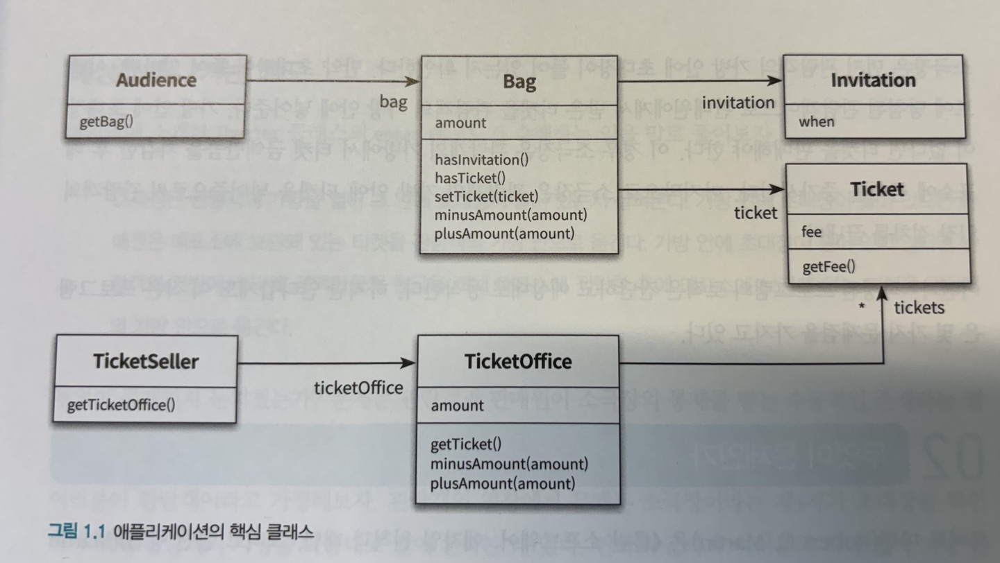
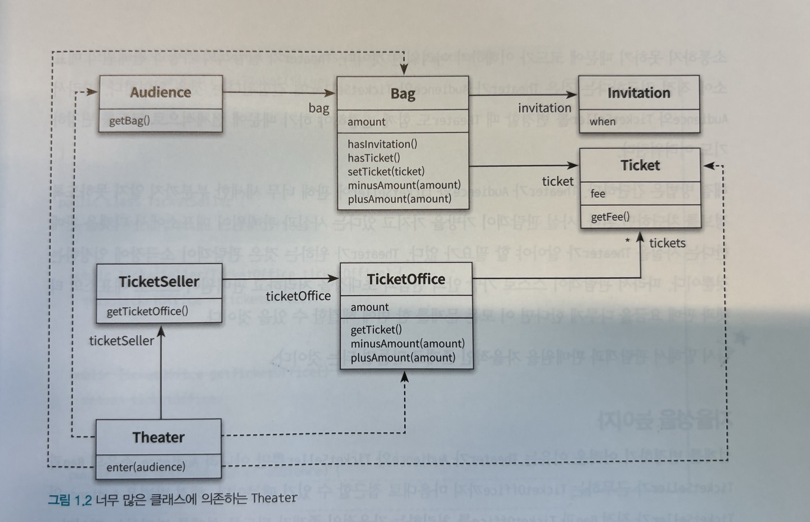
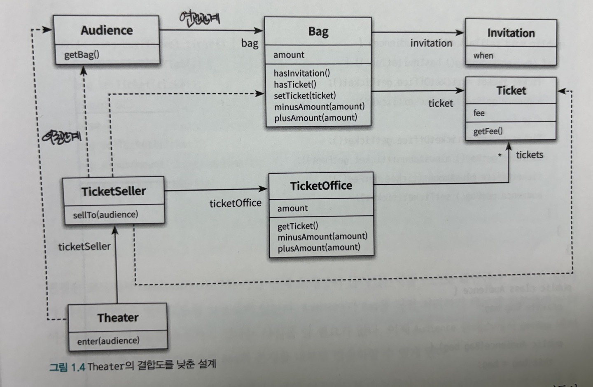
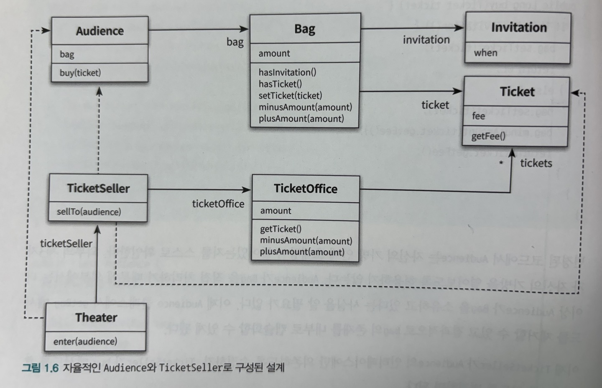
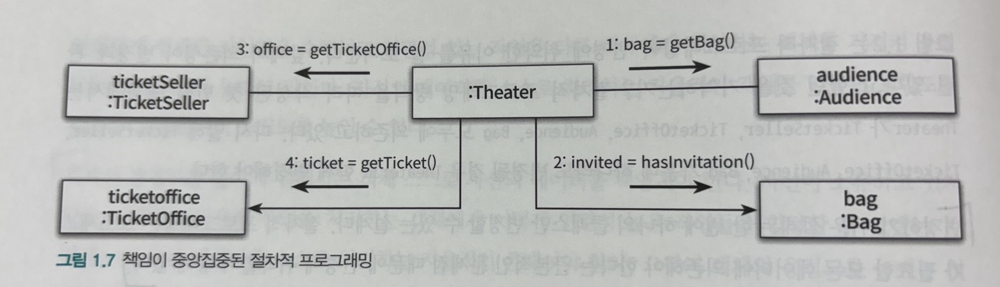
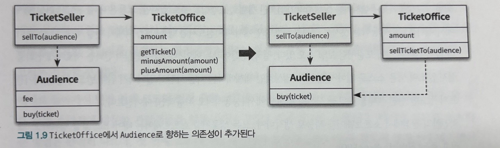

# 1장 객체, 설계

_이론이 먼저일까, 실무가 먼저일까? - 로버트 L. 글래스(Robert L. Glass)_

글래스의 결론을 한마디로 요약하면 이론보다 실무가 먼저다. 어떤 분야든 초기 단계에서는 아무것도 없는 상태에서 이론을 정립하기보다는 실무를 관찰한 결과를 바탕으로 이론을 정립하는 것이 최선이다.

이 책에서는 객체지행 페러다임을 설명하기 위해 추상적인 개념이나 이론을 앞세우지 않을 것이다. 개발자들이 잘 이해할 수 있도록 코드를 이용해 객체지향의 다양한 측면을 설명하려고 노력할 것이다.

## 01. 티켓 판매 애플리케이션 구현하기

세부사항

1. 이벤트를 통해 얻을 수 있는 무료로 관람할 수 있는 초대장 존재
2. 이벤트 당첨자와 그렇지 못한 사람은 다른 방식으로 입장
3. 이벤트 당첨자가 아니면 티켓을 구매해야함
4. 입장시키기 전에 당첨 여부를 확인한 후 당첨자가 아닌 경우 티켓을 판매 후 입장시켜야 함

초대장 구현

- 초대일자(when)을 인스턴스 변수로 포함하는 간단한 클래스

```ts
class Invitation {
  private _when: Date;
}
```

티켓 구현

```ts
class Ticket {
  private _fee: number;

  public get fee() {
    return this._fee;
  }
}
```

가방 구현

- 가방은 초대장(Invitation), 티켓(Ticket), 현금(amount)을 인스턴스 변수로 포함
- hasInvitation(초대장 보유 여부)
- hasTicket(티켓 보유 여부)
- plusAmount(현금 증가), minusAmount(현금 감소)
- setTicket(초대장을 티켓으로 교환)

```ts
class Bag {
  private _amount: number;
  private _invitation: Invitation | null;
  private _ticket: Ticket | null;

  public hasInvitation() {
    return this._invitation !== null;
  }

  public hasTicket() {
    return this._ticket !== null;
  }

  public setTicket(ticket: Ticket) {
    this._ticket = ticket;
  }

  public minusAmount(amount: number) {
    this._amount -= amount;
  }

  public plusAmount(amount: number) {
    this._amount += amount;
  }
}
```

가방 구현 보완

- 가방 인스턴스 변수 조합 케이스
  1. 현금 + 초대장
  2. only 현금
  - 위 조합 케이스에 따라 제약을 강제하도록 생성자 추가

```ts
class Bag {
  ...
  constructor(amount: number, invitation?: Invitation) {
    this._invitation = invitation || null;
    this._amount = amount;
  }
  ...
}
```

관람객 구현

- 가방을 인스턴스 변수로 포함(소지품 보관)

```ts
class Audience {
  private _bag: Bag;

  constructor(bag: Bag) {
    this._bag = bag;
  }

  public get bag() {
    return this._bag;
  }
}
```

매표소 구현

- 역할
  1. 초대장 티켓으로 교환
  2. 티켓 판매
- 역할에 따른 필요 요소
  - 판매할 티켓(tickets)
  - 티켓의 판매 금액(amount)

```ts
class TicketOffice {
  private _amount: number;
  private _tickets: Ticket[];

  constructor(amount: number, tickets: Ticket[]) {
    this._amount = amount;
    this._tickets = tickets;
  }

  public get ticket() {
    return this._tickets.shift();
  }

  public minusAmount(amount: number) {
    this._amount -= amount;
  }

  public plusAmount(amount: number) {
    this._amount += amount;
  }
}
```

판매원 구현

- 역할
  1. 매표소에서 초대장을 티켓으로 교환
  2. 매표소에서 티켓을 판매
- 역할에 따른 필요 요소
  - 자신이 일하는 매표소를 알고 있어야 함

```ts
class TicketSeller {
  private _ticketOffice: TicketOffice;

  constructor(ticketOfffice: TicketOffice) {
    this._ticketOffice = ticketOffice;
  }

  public get ticketOffice() {
    return this._ticketOffice;
  }
}
```



소극장 구현

- 역할
  1. 관람객을 맞이해야 함
- 행동 절차
  1. 관람객의 가방 안에 초대장이 있는지 확인
  2. 초대장이 있다면, 이벤트 당첨자이므로 판매원에게서 받은 티켓을 관람객의 가방 안에 넣어줌
  3. 초대장이 없다면, 티켓을 판매
  4. 3번의 경우 관람객의 가방에서 티켓 금액만큼을 차감한 후 매표소에 금액을 증가시킴
  5. 관람객의 가방안에 티켓을 넣어줌

```ts
class Theater {
  private _ticketSeller: TicketSeller;

  constructor(ticketSeller: TicketSeller) {
    this._tickerSeller = ticketSeller;
  }

  // 관람객을 맞이하는 역할을 위한 메서드
  public enter(audience: Audience) {
    if (audience.bag.hasInvitation()) {
      const ticket = this._ticketSeller.ticketOffice.ticket;
      audience.bag.setTicket(ticket);
    } else {
      const ticket = this._ticketSeller.ticketOffice.ticket;
      audience.bag.minusAmount(ticket.fee);
      this._ticketSeller.ticketOffice.plusAmount(ticket.fee);
      audience.bag.setTicket(ticket);
    }
  }
}
```

_지금까지 작성된 프로그램의 로직은 간단하고 예상대로 동작한다. 하지만 안타깝게도 이 작은 프로그램은 몇 가지 문제점을 가지고 있다._

## 02. 무엇이 문제인가

_모든 소프트웨어 모듈에는 세 가지 목적이 있다. 첫 번째 목적은 실행 중에 제대로 동작하는 것이다. 이것은 모듈의 존재 이유라고 할 수 있다. 두 번째 목적은 변경을 위해 존재하는 것이다. 대부분의 모듈은 생명주기 동안 변경되기 때문에 간단한 작업만으로도 변경이 가능해야 한다. 변경하기 어려운 모듈은 제대로 동작하더라도 개선해야 한다. 모듈의 세 번째 목적은 코드를 읽는 사람과 의사소통하는 것이다. 모듈은 특별한 훈련 없이도 개발자가 쉽게 읽고 이해할 수 있어야 한다. 읽는 사람과 의사소통을 할 수 없는 모듈은 개선해야 한다.[Martin02]_

앞에서 작성한 프로그램은 필요한 기능을 오류 없이 정확하게 수행하고 있기 때문에 첫 번째 목적은 만족시킨다. 하지만 불행하게도 `변경 용이성`과 `읽는 사람과의 의사소통`이라는 목적은 만족시키지 않는다. 그 이유를 살펴보자

### 예상을 빗나가는 코드

다시 한번 소극장 코드 내 행동 절차를 살펴본다

- 행동 절차
  1. 관람객의 가방 안에 초대장이 있는지 확인
  2. 초대장이 있다면, 이벤트 당첨자이므로 판매원에게서 받은 티켓을 관람객의 가방 안에 넣어줌
  3. 초대장이 없다면, 티켓을 판매
  4. 3번의 경우 관람객의 가방에서 티켓 금액만큼을 차감한 후 매표소에 금액을 증가시킴
  5. 관람객의 가방안에 티켓을 넣어줌

위 행동 절차를 통해 현재 관람객, 판매원이 소극장의 통제를 받는 `수동적` 존재라는 점을 볼 수 있다.

이해 가능한 코드란?

- 그 동작이 우리의 예상을 벗어나지 않는 코드
- 예시
  - 현실에서는 관람객이 직접 가방에서 초대장을 꺼내 판매원에게 건냄(능동적)
  - 판매원은 매표소에 있는 티켓을 직접 꺼내 관람객에게 건네고 관람객에게서 직접 돈을 받아 매표소에 보관(능동적)

### 변경에 취약한 코드

객체 사이의 `의존성(dependency)`과 관련된 문제

- 의존성은 `변경`과 관련이 있음
- 의존성은 변경에 대한 영향을 암시함
- 의존성이라는 말 속에는 어떤 객체가 변경될 때 그 객체에게 의존하는 다른 객체도 함께 변경될 수 있다는 사실이 내포돼 있음

`결합도(coupling)`

- 객체 사이의 의존성이 과한 경우 결합도가 높다고 함
- 객체들이 합리적인 수준으로 의존할 경우 결합도가 낮다고 함
- 결합도 역시 `변경`과 관련이 있음
- 결합도 높음 -> 함께 변경될 확률 높음

_따라서 설계의 목표는 객체 사이의 결합도를 낮춰 변경이 용이한 설계를 만드는 것이어야 함_



## 03. 설계 개선하기

예제 코드는 로버트 마틴이 이야기한 아래 세 가지 목적 중 한 가지는 만족시키지만 다른 두 조건은 만족시키지 못한다. 이 코드는 기능은 제대로 수행하지만 이해하기 어렵고 변경하기 쉽지 않다.

- 동작해야 함
- 변경이 용이해야 함
- 가독성이 높아야 함

`여기서 변경과 의사소통이라는 문제가 서로 엮여 있다는 점에 주목하라!` 코드를 이해하기 어려운 이유는 Theater가 관람객의 가방과 판매원의 매표소에 직접 접근하기 때문이다.(광현: _이 표현 자체에 주목하고 싶다. Theater 코드 스코프내에서 audience 객체가 bag을 보이게 되니 이건 Theater가 bag의 존재를 알게됨을 의미한다. Theater가 타 객체의 내부 사정까지 알 필요는 없다_)

코드를 개선하는 방향은 명확하다. 관람객과 판매원을 `자율적인 존재`로 만들면 된다.

### 자율성을 높이자

설계를 변경하기 어려운 이유

Theater가 Audience와 TicketSeller뿐만 아니라 Audience 소유의 Bag과 TicketSeller가 근무하는 TicketOffice까지 마음대로 접근 가능

- 해결 방법

  - Audience와 TicketSeller가 직접 Bag과 TicketOffice를 처리하는 자율적인 존재가 되도록 설계 변경

해결 첫번째 단계

- Theater의 enter 메서드에서 TicketOffice에 접근하는 모든 코드를 TicketSeller 내부로 숨기기
  - TicketSeller에 sellTo 메서드를 추가하고 Theater에 있던 로직을 이 메서드로 옮기기

```ts
class Theater {
  private _ticketSeller: TicketSeller;

  constructor(ticketSeller: TicketSeller) {
    this._tickerSeller = ticketSeller;
  }

  public enter(audience: Audience) {
    // TicketSeller 의 sellTo로 옮긴다.
    // if (audience.bag.hasInvitation()) {
    //   const ticket = ticketSeller.ticketOffice.ticket;
    //   audience.bag.setTicket(ticket);
    // } else {
    //   const ticket = ticketSeller.ticketOffice.ticket;
    //   audience.bag.minusAmount(ticket.fee);
    //   ticketSeller.ticketOffice.plusAmount(ticket.fee);
    //   audience.bag.setTicket(ticket);
    // }
  }
}

class TicketSeller {
  private _ticketOffice: TicketOffice;

  constructor(ticketOfffice: TicketOffice) {
    this._ticketOffice = ticketOffice;
  }

  // 제거한다.
  // public get ticketOffice() {
  //   return this._ticketOffice;
  // }

  public sellTo(audience: Audience) {
    // Theater의 enter 메서드의 구현을 옮겼다.
    if (audience.bag.hasInvitation()) {
      const ticket = this._ticketOffice.ticket;
      audience.bag.setTicket(ticket);
    } else {
      const ticket = this._ticketOffice.ticket;
      audience.bag.minusAmount(ticket.fee);
      this._ticketOffice.plusAmount(ticket.fee);
      audience.bag.setTicket(ticket);
    }
  }
}
```

주목할 것

- TicketSeller에서 `get ticketOffice` 메서드가 제거됨

  - ticketOffice의 가시성이 private이고 접근가능한 public 메서드가 존재하지 않기 때문에 외부에선 ticketOfiice에 직접 접근할 수 없음
  - 결과적으로 ticketOffice에 대한 접근은 오직 TicketSeller 안에만 존재
  - 따라서 TicketSeller는 ticketOffice에서 티켓을 꺼내거나 판매 요금을 적립하는 일을 `스스로 수행`할 수 밖에 없음

변경된 Theater

```ts
class Theater {
  private _ticketSeller: TicketSeller;

  constructor(ticketSeller: TicketSeller) {
    this._tickerSeller = ticketSeller;
  }

  public enter(audience: Audience) {
    this._ticketSeller.sellTo(audience);
  }
}
```

주목할 것

- 변경된 Theater 내 ticketOffice에 접근할 수 있는 방법은 더이상 없음
- Theater는 ticketOffice가 TicketSeller 내부에 존재하느다는 사실을 알지 못함
- Theater는 오직 TicketSeller의 `인터페이스(interface)`에만 의존



`Theater 로직을 TicketSeller 로 이동`의 성과

- Theater에서 TicketOffice로의 의존성이 제거됨

  - TicketSeller와 협력하는 TicketOffice의 내부 구현이 성공적으로 캡슐화됨

다음 해야할 일

- 위와 비슷한 방법으로 Audience의 캡슐화 개선
  - Bag에 접근하는 모든 로직을 Audience의 내부로 감추기

```ts
class TicketSeller {
  // Audience 의 buy() 로 옮긴다
  // private _ticketOffice: TicketOffice;

  constructor(ticketOfffice: TicketOffice) {
    this._ticketOffice = ticketOffice;
  }

  public sellTo(audience: Audience) {
    if (audience.bag.hasInvitation()) {
      const ticket = this._ticketOffice.ticket;
      // Audience 의 buy() 로 옮긴다
      //   audience.bag.setTicket(ticket);
      // } else {
      const ticket = this._ticketOffice.ticket;
      // Audience 의 buy() 로 옮긴다
      //   audience.bag.minusAmount(ticket.fee);
      //   this._ticketOffice.plusAmount(ticket.fee);
      //   audience.bag.setTicket(ticket);
      // }
    }
  }
}

class Audience {
  private _bag: Bag;

  constructor(bag: Bag) {
    this._bag = bag;
  }

  // 제거한다
  // public get bag() {
  //   return this._bag;
  // }

  public buy(ticket: Ticket) {
    // 여기로 TicketSeller의 코드를 일부 옮긴다
  }
}
```

변경된 Audience

- audience는 이제 가방 안에 초대장이 들어있는지 스스로 확인
- Bag의 존재를 내부로 캡슐화 완료

```ts
class Audience {
  private _bag: Bag;

  constructor(bag: Bag) {
    this._bag = bag;
  }

  public buy(ticket: Ticket) {
    this._bag.setTicket(ticket);
    if (this._bag.hasInvitation()) {
      return 0;
    } else {
      this._bag.minusAmount(ticket.getFee());
      return ticket.getFee();
    }
  }
}
```

TicketSeller가 Audience의 인터페이스에만 의존하도록 수정

- 수정에 대한 효과
  - TicketSeller와 Audience 사이의 결합도 감소
  - 내부 구현 캡슐화로 인해 Audience의 구현 수정은 더이상 TicketSeller에 영향을 미치지 않음

```ts
class TicketSeller {
  private _ticketOffice: TicketOffice;

  constructor(ticketOfffice: TicketOffice) {
    this._ticketOffice = ticketOffice;
  }

  public sellTo(audience: Audience) {
    this._ticketOffice.plusAmount(audience.buy(this._ticketOffice.getTicket()));
  }
}
```

_모든 수정이 끝났다. 아래 그림을 볼 때 가장 크게 달라진 점은 Audience와 TicketSeller가 자율적인 존재가 된것이다._


### 무엇이 개선됐는가

수정된 Audience와 TicketSeller는 자신이 가지고 있는 소지품을 스스로 관리한다. 이에 따라 중요한 점은 Audience나 TicketSeller의 내부 구현을 변경하더라도 Theater를 함께 변경할 필요가 없어졌다. 가방 대신 작은 지갑으로 코드를 변경할 수 있고, TicketSeller가 매표소가 아닌 은행에 돈을 보관하게 만들 수도 있다.

### 캡슐화와 응집도

응집도

- 밀접하게 연관된 작업만을 수행하고 연관성 없는 작업은 다른 객체에게 위임하는 객체는 응집도가 높음
- 자신의 데이터를 스스로 처리하는 자율적인 객체를 만들면 결합도는 낮추고 응집도는 높일 수 있음

객체의 응집도를 높이기 위해서는 객체 스스로 자신의 데이터를 책임져야 한다. 자신이 소유하고 있지 않은 데이터를 이용해 작업을 처리하는 객체에게 어떻게 연관성 높은 작업들을 할당할 수 있겠는가? 객체는 자신의 데이터를 스스로 처리하는 자율적인 존재여야 한다. 그것이 객체의 응집도를 높이는 첫 걸음이다. 외부의 간섭을 최대한 배제하고 메시지를 통해서만 협력하는 자율적인 객체들의 공동체를 만드는 것이 훌륭한 객체지향 설계를 얻을 수 있는 지름길인 것이다.

### 절차지향과 객체지향

수정하기 전의 코드에서는 Theater의 Enter 메서드 안에서 Audience, TicketSeller, Bag과 TicketOffice를 가져와 관람객을 입장시키는 절차를 구현했다. 이 관점에서 enter 메서드는 `프로세스(Process)`이며 Audience, TicketSeller, Bag, TicketOffice는 `데이터(Data)`이다. 이처럼 프로세스와 데이터를 별도의 모듈에 위치시키는 방식을 `절차적 프로그래밍(Procedural Programming)`이라고 부른다.

수정하기 전의 코드는 절차적 프로그래밍 방식으로 작성된 코드의 전혁적인 의존성 구조를 보여준다. 프로세스를 담당하는 Theater가 TicketSeller, TicketOffice, Audience, Bag 모두에 의존하고 있음에 주목하라. `이것은 모든 처리가 하나의 클래스 안에 위치하고 나머지 클래스는 단지 데이터의 역할만 수행하기 때문이다.`

변경하기 쉬운 설계는 한 번에 하나의 클래스만 변경할 수 있는 설계다. 절차적 프로그래밍은 프로세스가 필요한 모든 데이터에 의존해야 한다는 근본적인 문제점 때문에 변경에 취약할 수밖에 없다.

### 책임의 이동



변경 전의 절차지향 설계에서는 Theater가 모든 책임을 도맡고 있는 것을 볼 수 있다.


변경 후의 객체지향 설계에서는 각 객체가 자신이 맡은 일을 스스로 처리했다. 다시 말해 Theater에 몰려 있던 책임이 개별 객체로 이동한 것이다. 이것이 바로 `책임의 이동`이 의미하는 것이다.

객체지향 설계에서는 독재자가 존재하지 않고 각 객체에 책임이 적절하게 분배된다. 따라서 각 객체는 `자신을 스스로 책임`진다. 객체지향 애플리케이션은 스스로 책임을 수행하는 자율적인 객체들의 공동체를 구성함으로써 완성된다.

`객체지향 설계의 핵심은 적절한 객체에 적절한 책임을 할당하는 것이다.`

### 더 개선할 수 있다

Bag의 캡슐화

- Audience내에 여전히 수동적인 역할을 수행하고 있는 Bag을 자율적인 존재로 개선

```ts
class Bag {
  private _amount: number;
  private _invitation: Invitation | null;
  private _ticket: Ticket | null;

  ...


  public hold(ticket: Ticket) {
    if (this.hasInvitation()) {
      this.setTicket(ticket);
      return 0;
    } else {
      this.setTicket(ticket);
      this.minusAmount(ticket.getFee());
      return ticket.getFee();
    }
  }

  // 더이상 외부로 노출할 일이 없어 private으로 전환
  private hasInvitation() {
    return this._invitation !== null;
  }

  // 더이상 외부로 노출할 일이 없어 private으로 전환
  private setTicket(ticket: Ticket) {
    this._ticket = ticket;
  }

  // 더이상 외부로 노출할 일이 없어 private으로 전환
  private minusAmount(amount: number) {
    this._amount -= amount;
  }

  ...
}

class Audience {
  private _bag: Bag;

  constructor(bag: Bag) {
    this._bag = bag;
  }

  public buy(ticket: Ticket) {
    return this._bag.hold(ticket);
  }
}
```

TicketOffice 캡슐화

- TicketOffice의 자율성은 높였으나 audience와의 결합이 생겨나면서 전체적인 결합도는 증가

```ts
class TicketSeller {
  private _ticketOffice: TicketOffice;

  constructor(ticketOfffice: TicketOffice) {
    this._ticketOffice = ticketOffice;
  }

  public sellTo(audience: Audience) {
    // ticketOffice에게로 위임
    this._ticketOffice.sellTicketTo(audience);
  }
}

class TicketOffice {
  private _amount: number;
  private _tickets: Ticket[];

  constructor(amount: number, tickets: Ticket[]) {
    this._amount = amount;
    this._tickets = tickets;
  }

  // 자율적으로 해결할 수 있는 메서드 추가
  public sellTicketTo(audience: Audience) {
    this.plusAmount(audience.buy(this.ticket));
  }

  // 더이상 외부로 노출할 필요가 없어 private으로 전환
  private get ticket() {
    return this._tickets.shift();
  }

  // 더이상 외부로 노출할 필요가 없어 private으로 전환
  private plusAmount(amount: number) {
    this._amount += amount;
  }
}
```



위 작은 예제를 통해 두 가지 사실을 알 수 있다.

- 어떤 기능을 설계하는 방법은 한 가지 이상일 수 있다.
- 동일한 기능을 한 가징 이상의 방법으로 설계할 수 있기 때문에 결국 설계는 트레이드오프의 산물이다.

_어떤 경우에도 모든 사람들을 만족시킬 수 있는 설계를 만들 수는 없다._

설계는 균형의 예술이다. 훌륭한 설계는 적절한 트레이드오프의 결과물이라는 사실을 명심하라.

### 그래, 거짓말이다!

훌륭한 객체지향 설계란 소프트웨어를 구성하는 모든 객체들이 자율적으로 행동하는 설계를 가리킨다. 그 대상이 비록 실세계에서는 생명이 없는 수동적인 존재라고 하더라도 객체지향의 세계로 넘어오는 순간 그들은 생명과 지능을 가진 싱싱한 존재로 다시 태어난다.

## 04. 객체지향 설계

### 설계란 왜 필요한가

좋은 설계란 무엇인가?

- 오늘 요구하는 기능을 온전히 수행하면서 내일의 변경을 매끄럽게 수용할 수 있는 설계

### 객체지향 설계

훌륭한 객체지향 설계란 협력하는 객체 사이의 의존성을 적절하게 관리하는 설계다.
