# 2장 객체지향 프로그래밍

## 01. 영화 예매 시스템

### 요구사항 살펴보기

1. '영화'와 '상영'이라는 개념을 구분할 것이다.
   - 영화
     - 제목, 상영시간, 가격 정보와 같이 영화가 가지고 있는 기본적인 정보를 가리킬 때 사용
   - 상영
     - 실제로 관객들이 영화를 관람하는 사건을 표현할 때 사용
     - 상영 일자, 시간, 순번 등을 가리키기 위해 사용
   - 영화는 하루 중 다양한 시간대에 걸쳐 한 번 이상 상영될 수 있다.
   - 이 둘을 구분하는 가장 중요한 이유는 `사용자가 실제 예매하는 대상은 영화가 아닌 상영이기 때문이다.`
2. 할인 조건(discount condition), 할인 정책(discount policy)

   - 할인 조건

     - 가격의 할인 여부 결정
     - 순서 조건(sequence condition), 기간 조건(period condition) 으로 구성
     - 순서 조건
       - 상영 순번을 이용해 할인 여부를 결정하는 규칙
     - 기간 조건
       - 영화 상영 시작 시간을 이용해 할인 여부를 결정하는 규칙

   - 할인 정책
     - 할인 요금을 결정
     - 금액 할인 정책(amount discount policy), 비율 할인 정책(percent discount policy) 으로 구성
     - 금액 할인 정책
       - 일정 금액 할인
     - 비율 할인 정책
       - 정가에서 일정 비율의 요금을 할인
   - 영화별로 하나의 할인 정책만 할당 가능(지정하지 않는 경우도 가능)
   - 할인 조건은 다수의 할인 조건 지정 가능, 순서 조건과 기간 조건을 섞는 것도 가능

## 02. 객체지향 프로그래밍을 향해

### 협력, 객체, 클래스

진정한 객체지향 패러다임으로의 전환은 `클래스가 아닌 객체`에 초점을 맞출때에만 얻을 수 있다. 이를 위해 다음 두 가지에 집중해야 한다.

1. 어떤 클래스가 필요한지를 고민하기 전에 어떤 객체들이 필요한지 고민하라.
2. 객체를 독립적인 존재가 아니라 기능을 구현하기 위해 협력하는 공동체의 일원으로 봐야 한다.

### 도메인의 구조를 따르는 프로그램의 구조

문제를 해결하기 위해 사용자가 프로그램을 사용하는 분야를 `도메인`이라고 부른다.

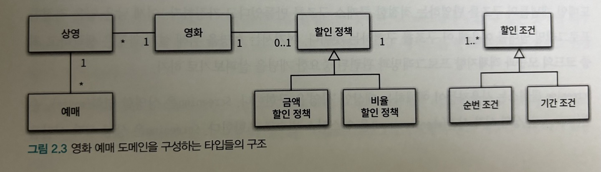

위 구조를 기반으로 한 클래스의 구조는 아래와 같아야 한다.

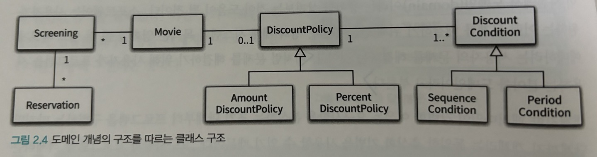

### 클래스 구현하기

Screening 클래스

- 인스턴스 변수
  - 상영할 영화(movie)
  - 순번(sequence)
  - 상영 시작 시간(whenScreened)
- 메서드
  - get startTime(상영 시작 시간 반환)
  - isSequence(순번의 일치 여부)
  - get movieFee(기본 요금 반환)

```ts
class Screening {
  private _movie: Movie;
  private _sequence: number;
  private whenScreened: Date;

  constructor(movie: Movie, sequence: number, whenScreened: Date) {
    this._movie = movie;
    this._sequence = sequence;
    this._whenScreened = whenScreened;
  }

  get startTime() {
    return this._whenScreened;
  }

  get movieFee() {
    return this._movie.fee;
  }

  isSequence(sequence: number) {
    return this._sequence === sequence;
  }
}
```

여기서 주목할 점은 인스턴스 변수의 가시성은 private이고 메서드의 가시성은 public이라는 것이다. 클래스를 구현하거나 다른 개발자에 의해 개발된 클래스를 사용할 때 가장 중요한 것은 클래스의 `경계`를 구분 짓는 것이다. 클래스는 내부와 외부로 구분되며 훌륭한 클래스를 설계하기 위한 핵심은 어떤 부분을 외부에 공개하고 어떤 부분을 감출지를 결정하는 것이다. Screening에서 알 수 있는 것처럼 외부에서는 객체의 속성에 직접 접근할 수 없도록 막고 적절한 public 메서드를 통해서만 내부 상태를 변경할 수 있게 해야 한다.

_경계의 명확성은 객체의 자율성을 보장한다._

### 프로그래머의 자유

접근 제어 메커니즘은 프로그래밍 차원에서 클래스의 내부와 외부를 명확하게 경계 지을 수 있게 하는 동시에 클래스 작성자가 내부 구현을 은닉할 수 있게 해준다. 또한 클라이언트 프로그래머가 실수로 숨겨진 부분에 접근하는 것을 막아준다. 클라이언트 프로그래머가 private 속성이나 메서드에 접근하려고 시도하면 컴파일러는 오류를 뱉어낼 것이다.

### 협력하는 객체들의 공동체

영화를 예매하는 기능을 구현하는 메서드

```ts
class Screening {
  reserve(customer: Customer, audienceCount: number) {
    return new Reservation(
      customer,
      this,
      this.calculateFee(audienceCount),
      audienceCount
    );
  }

  private calculateFee(audienceCount: number) {
    return this._movie.calculateMovieFee(this).times(audienceCount);
  }
}
```

Money 클래스

```ts
class Money {
  static ZERO = Money.wons(0);
  private _amount: number;

  static wons(amount: number) {
    return new Money(amount);
  }

  constructor(amount: number) {
    this._amount = amount;
  }

  plus(amount: Money) {
    return new Money(this._amount + amount.amount);
  }

  minus(amount: Money) {
    return new Money(this._amount - amount.amount);
  }

  times(percent: number) {
    return new Money(this._amount * percent);
  }

  isLessThan(other: Money) {
    return this._amount < other.amount;
  }

  isGreaterThanOrEqual(other: Money) {
    return this._amount >= other.amount;
  }

  get amount() {
    return this._amount;
  }
}
```

의미를 좀 더 명시적이고 분명하게 표현할 수 있다면 객체를 사용해서 해당 개념을 구현하라. 그 개념이 비록 하나의 인스턴스 변수만 포함하더라도 개념을 명시적으로 표현하는 것은 전체적인 설계의 명확성과 유연성을 높이는 첫 걸음이다.

Reservation 클래스

- 인스턴스 변수
  - 고객(customer)
  - 상영 정보(screening)
  - 예매 요금(fee)
  - 인원 수(audienceFee)

```ts
class Reservation {
  private _customer: Customer;
  private _screening: Screnning;
  private _fee: Money;
  private _audienceCount: number;

  constructor(
    customer: Customer,
    screening: Screening,
    fee: Money,
    audienceCount: number
  ) {
    this._customer = customer;
    this._screening = screening;
    this._fee = fee;
    this._audienceCount = audienceCount;
  }
}
```

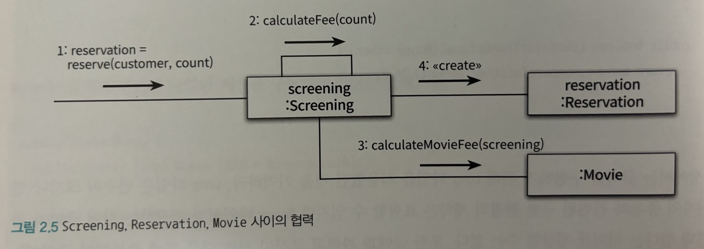

객체지향 프로그램을 작성할 때는 먼저 `협력의 관점`에서 어떤 객체가 필요한지를 결정하고, 객체들의 공통 상태와 행위를 구현하기 위해 클래스를 작성한다. 따라서 협력에 대한 개념을 간략하게라도 살펴 보는 것이 이후의 이야기를 이해하는 데 도움이 될 것이다.

### 협력에 관한 짧은 이야기

객체가 다른 객체와 상호작용할 수 있는 유일한 방법은 `메시지를 전송(send a message)`하는 것뿐이다. 다른 객체에게 요청이 도착할 때 해당 객체가 `메시지를 수신(receive a message)`했다고 이야기 한다. 메시지를 수신한 객체는 스스로의 결정에 따라 자율적으로 메시지를 처리할 방법을 결정한다. 이처럼 수신된 메시지를 처리하기 위한 자신만의 방법을 `메서드(method)`라고 부른다.

지금까지는 Screening이 Movie의 calculateMovieFee '메서드를 호출한다'고 말했지만 사실은 Screening이 Movie에게 calculateMovieFee '메시지를 전송한다'라고 말하는 것이 더 적절한 표현이다. 사실 Screening은 Movie 안에 calculateMovieFee 메서드가 존재하고 있는지조차 알지 못한다. 단지 Movie가 calculateMovieFee 메시지에 응답할 수 있다고 믿고 메시지를 전송할 뿐이다.

메시지를 처리하는 방법을 결정하는 것은 Movie 스스로의 문제이다. 이것이 객체가 메시지를 처리하는 방법을 자율적으로 결정할 수 있다고 말했던 이유다.

## 03. 할인 요금 구하기

### 할인 요금 계산을 위한 협력 시작하기

Movie 클래스

- 인스턴스 변수
  - 제목(title)
  - 상영시간(runningTime)
  - 기본요금(fee)
  - 할인 정책(discountPolicy)

```ts
class Movie {
  private _title: string;
  // 책에는 Duration이라는 Java 내장 클래스를 사용하고 있으나 편의상 아래와 같이 사용한다
  private _runningMinutes: number;
  private _fee: Money;
  private _discountPolicy: DiscountPolicy;

  constructor(
    title: string,
    runningMinutes: number,
    fee: Money,
    discountPolicy: DiscountPolicy
  ) {
    this._title = title;
    this._runningMinutes = runningMinutes;
    this._fee = fee;
    this._discountPolicy = discountPolicy;
  }

  calculateMovieFee(screening: Screening) {
    return this._fee.minus(
      this._discountPolicy.calculateDiscountAmount(screening)
    );
  }

  get fee() {
    return this._fee;
  }
}
```

위 코드에는 객체지향에서 중요하다고 여겨지는 두 가지 개념이 숨겨져 있다. 하나는 `상속(inheritance)`이고 다른 하나는 `다형성`이다. 그리고 그 기반에는 `추상화(abstraction)`라는 원리가 숨겨져 있다.

### 할인 정책과 할인 조건

추상 클래스인 DiscountPolicy

```ts
abstract class DiscountPolicy {
  private _conditions: DiscountCondition[];

  constructor(conditions: DiscountCondition[]) {
    this._conditions = conditions;
  }

  calculateDiscountAmount(screening: Screening) {
    this._conditions.forEach((condition) => {
      if (condition.isSatisfiedBy(screening)) {
        return this.getDiscountAmount(screening);
      }
    });

    return Money.ZERO;
  }

  protected abstract getDiscountAmount(screening: Screening): Money;
}
```

DiscountPolicy는 할인 여부와 요금 계산에 필요한 `전체적인 흐름은 정의`하지만 실제로 요금을 계산하는 부분은 추상 메서드인 getDiscountAmount 메서드에게 위임한다. 실제로는 DiscountPolicy를 상속받은 자식 클래스에서 오버라이딩한 메서드가 실행될 것이다. 이처럼 부모 클래스에 기본적인 알고리즘의 흐름을 구현하고 중간에 필요한 처리를 자식 클래스에게 위임하는 디자인 패턴을 `TEMPLATE METHOD 패턴[GOF94]`이라고 부른다.

DiscountCondition 인터페이스

```ts
interface DiscountCondition {
  isSatisfiedBy(screening: Screening): boolean;
}
```

SequenceCondition 클래스

- 인스턴스 변수
  - 순번(sequence)
- 메서드
  - isSatisfiedBy(screening)

```ts
class SequenceCondition implements DiscountCondition {
  private _sequence: number;

  constructor(sequence: number) {
    this._sequence = sequence;
  }

  isSatisfiedBy(screening: Screening) {
    return screening.isSequence(this._sequence);
  }
}
```

PeriodCondition 클래스

- 인스턴스 변수
  - 순번(sequence)
- 메서드
  - isSatisfiedBy(screening)

```ts
export enum DayOfWeek {
  SUNDAY,
  MONDAY,
  TUESDAY,
  WEDNESDAY,
  THURSDAY,
  FRIDAY,
  SATURDAY,
}

class HHmm {
  private _hh: number;
  private _mm: number;

  constructor(hh: number, mm: number) {
    this._hh = hh;
    this._mm = mm;
  }

  static of(hh: number, mm: number): HHmm {
    return new HHmm(hh, mm);
  }

  compareTo(target: HHmm) {
    if (this._hh < target.hh) {
      return -1;
    } else if (this._hh === target.hh) {
      if (this._mm < target.mm) {
        return -1;
      } else if (this._mm === target.mm) {
        return 0;
      } else {
        return 1;
      }
    } else {
      return 1;
    }
  }

  get hh() {
    return this._hh;
  }

  get mm() {
    return this._mm;
  }
}

class PeriodCondition implements DiscountCondition {
  private _dayOfWeek: DayOfWeek;
  private _startTime: HHmm;
  private _endTime: HHmm;

  constructor(dayOfWeek: DayOfWeek, startTime: HHmm, endTime: HHmm) {
    this._dayOfWeek = dayOfWeek;
    this._startTime = startTime;
    this._endTime = endTime;
  }

  isSatisfiedBy(screening: Screening) {
    const screeningStartTime = dayjs(screening.startTime);
    const hhmmFromScreeningStartTime = HHmm.of(
      screeningStartTime.hour(),
      screeningStartTime.minute()
    );

    return (
      dayjs(screening.startTime).day() === this._dayOfWeek &&
      this._startTime.compareTo(hhmmFromScreeningStartTime) <= 0 &&
      this._endTime.compareTo(hhmmFromScreeningStartTime) >= 0
    );
  }
}
```

AmountDiscountPolicy 클래스

- 인스턴스 변수
  - 할인 요금(discountAmount)

```ts
class AmountDiscountPolicy extends DiscountPolicy {
  private _discountAmount: Money;

  constructor(discountAmount: Money, conditions: DiscountCondition[]) {
    super(conditions);
    this._discountAmount = discountAmount;
  }

  protected getDiscountAmount(screening: Screening) {
    return this._discountAmount;
  }
}
```

PercentDiscountPolicy 클래스

- 인스턴스 변수
  - 할인 비율(percent)

```ts
class PercentDiscountPolicy extends DiscountPolicy {
  private _percent: number;

  constructor(percent: number, conditions: DiscountCondition[]) {
    super(conditions);
    this._percent = percent;
  }

  protected getDiscountAmount(screening: Screening) {
    return screening.movieFee.times(this._percent);
  }
}
```

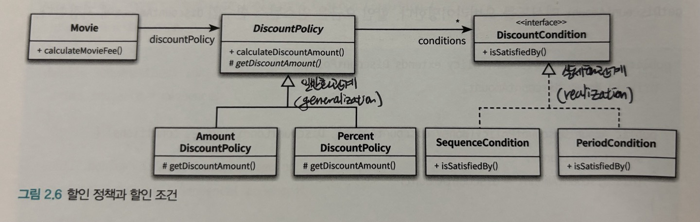

### 할인 정책 구성하기

실제 영화 객체를 생성하는 방법

```ts
const avatar: Movie = new Movie(
  "아바타",
  120,
  Money.wons(10000),
  new AmountDiscountPolicy(Money.wons(800), [
    new SequenceCondition(1),
    new SequenceCondition(10),
    new PeriodCondition(DayOfWeek.MONDAY, HHmm.of(10, 0), HHmm.of(11, 59)),
    new PeriodCondition(DayOfWeek.THURSDAY, HHmm.of(10, 0), HHmm.of(20, 59)),
  ])
);

const titanic: Movie = new Movie(
  "타이타닉",
  180,
  Money.wons(11000),
  new PercentDiscountPolicy(0.1, [
    new PeriodCondition(DayOfWeek.TUESDAY, HHmm.of(14, 0), HHmm.of(16, 59)),
    new SequenceCondition(2),
    new PeriodCondition(DayOfWeek.THURSDAY, HHmm.of(10, 0), HHmm.of(13, 59)),
  ])
);
```

## 04. 상속과 다형성

### 컴파일 시간 의존성과 실행 시간 의존성

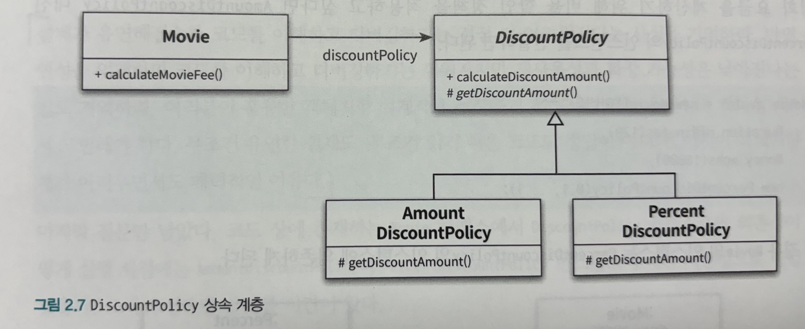

Movie의 인스턴스는 실행 시에 AmountDiscountPolicy나 PercentDiscountPolicy의 인스턴스에 의존해야 한다. 하지만 코드 수준에서 Movie 클래스는 이 두 클래스 중 어떤 것에도 의존하지 않는다. 오직 추상 클래스인 DiscountPolicy에만 의존하고 있다.

_코드의 의존성과 실행 시점의 의존성이 서로 다를 수 있다._

한 가지 간과해서는 안 되는 사실은 `코드의 의존성과 실행 시점의 의존성이 다르면 다를수록 코드를 이해하기 어려워진다`는 것이다. 코드를 이해하기 위해서는 코드뿐만 아니라 객체를 생성하고 연결하는 부분을 찾아야 하기 때문이다. 반면 `코드의 의존성과 실행 시점의 의존성이 다르면 다를수록 코드는 더 유연해지고 확장 가능해진다`. 이와 같은 의존성의 양면성은 `설계가 트레이드오프의 산물`이라는 사실을 잘 보여준다.

설계가 유연해질수록 코드를 이해하고 디버깅하기는 점점 더 어려워진다는 사실을 기억하라. 반면 유연성을 억제하면 코드를 이해하고 디버깅하기는 쉬워지지만 재사용성과 확장 가능성은 낮아진다는 사실도 기억하라. 여러분이 훌륭한 객체지향 설계자로 성장하기 위해서는 항상 유연성과 가독성 사이에서 고민해야 한다. 무조건 유연한 설계도, 무조건 읽기 쉬운 코드도 정답이 아니다. 이것이 객체지향 설계가 어려우면서도 매력적인 이유다.

### 차이에 의한 프로그래밍

부모 클래스와 다른 부분만을 추가해서 새로운 클래스를 쉽고 빠르게 만드는 방법을 `차이에 의한 프로그래밍(Programming by difference)`이라고 부른다.

### 상속과 인터페이스

인터페이스는 객체가 이해할 수 있는 `메시지`의 목록을 정의한다는 것을 기억하라. 상속을 통해 자식 클래스는 자신의 인터페이스에 부모 클래스의 인터페이스를 포함하게 된다. 결과적으로 자식 클래스는 부모 클래스가 수신할 수 있는 모든 메시지를 수신할 수 있기 때문에 외부 객체는 자식 클래스를 부모 클래스와 동일한 타입으로 간주할 수 있다.

```ts
class Movie {
  /* 생략 */
  calculateMovieFee(screening: Screening) {
    return this._fee.minus(
      this._discountPolicy.calculateDiscountAmount(screening)
    );
  }
}
```

Movie 입장에서는 자신과 협력하는 객체가 어떤 클래스의 인스턴스인지가 중요한 것이 아니라 calculateDiscountAmount 메시지를 수신할 수 있다는 사실이 중요하다. 따라서 calculateDiscountAmount 메시지를 수신할 수 있는 AmountDiscountPolicy와 PercentDiscountPolicy 모두 DiscountPolicy를 대신해서 Movie와 협력이 가능하다.

_컴파일러는 코드 상에서 부모 클래스가 나오는 모든 장소에서 자식 클래스를 사용하는 것을 허용한다._

자식 클래스가 부모 클래스를 대신하는 것을 `업캐스팅(upcasting)`이라고 부른다.
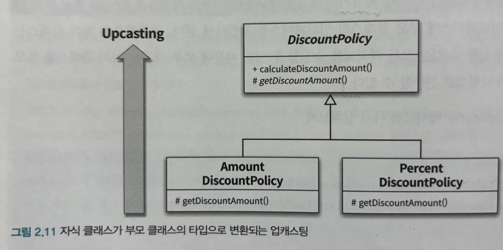

### 다형성

다시 한번 강조하지만 `메시지와 메서드는 다른 개념`이다.

코드 상에서 Movie 클래스는 DiscountPolicy 클래스에게 메시지를 전송하지만 실행 시점에 실제로 실행되는 메서드는 Movie와 협력하는 객체의 실제 클래스가 무엇인지에 따라 달라진다. 다시 말해서 Movie는 동일한 메시지를 전송하지만 실제로 어떤 메서드가 실행될 것인지는 메시지를 수신하는 객체의 클래스가 무엇이냐에 따라 달라진다. 이를 `다형성`이라고 부른다.

_다형성은 컴파일 시간 의존성과 실행 시간 의존성을 다르게 만들 수 있는 객체지향의 특성을 이용해 서로 다른 메서드를 실행할 수 있게 한다._

다형성이란 `동일한 메시지를 수신했을 때 객체의 타입에 따라 다르게 응답할 수 있는 능력`을 의미한다. 따라서 다형적인 협력에 참여하는 객체들은 모두 같은 메시지를 이해할 수 있어야 한다. 다시 말해 `인터페이스가 동일해야 한다`는 것이다. AmountDiscountPolicy와 PercentDiscountPolicy가 다형적인 협력에 참여할 수 있는 이유는 이들이 DiscountPolicy로부터 동일한 인터페이스를 물려받았기 때문이다. 그리고 이 두 클래스의 인터페이스를 통일하기 위해 사용한 구현 방법이 바로 상속인 것이다.

지연 바인딩(lazy binding) or 동적 바인딩(dynamic binding)

- 메시지와 메서드를 실행 시점에 바인딩하는 것

초기 바인딩(early binding) or 정적 바인딩(static binding)

- 전통적인 함수 호출처럼 컴파일 시점에 실행될 함수나 프로시저를 결정하는 것

객체지향이 컴파일 시점의 의존성과 실행 시점의 의존성을 분리하고, 하나의 메시지를 선택적으로 서로 다른 메서드에 연결할 수 있는 이유가 바로 지연 바인딩이라는 메커니즘을 사용하기 때문이다.

_상속은 구현 상속이 아니라 인터페이스 상속을 위해 사용해야 한다._

### 인터페이스와 다형성

추상 클래스를 사용해 다형성을 구현했던 할인 정책과 달리 할인 조건은 구현을 공유할 필요가 없기 때문에 아래 그림과 같이 인터페이스를 이용해 타입 계층을 구현했다.
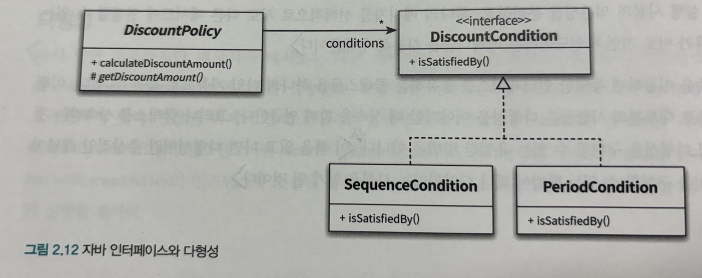

## 05. 추상화와 유연성

### 추상화의 힘

아래 그림은 자식 클래스를 생략한 코드 구조를 그림으로 표현한 것이다. 이 그림은 추상화를 사용할 경우의 두 가지 장점을 보여준다.

1. 추상화의 계층만 따로 떼어 놓고 살펴보면 요구사항의 정책을 높은 수준에서 서술할 수 있다.
2. 추상화를 이용하면 설계가 좀 더 유연해진다.

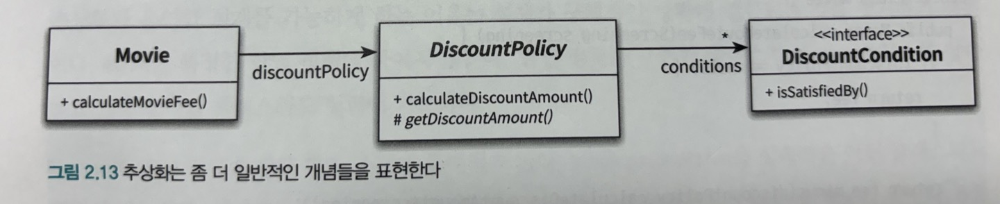

추상화를 이용해 상위 정책을 기술한다는 것은 기본적인 애플리케이션의 협력 흐름을 기술한다는 것을 의미한다. 이 개념은 매우 중요한데, 재사용 가능한 설계의 기본을 이루는 디자인 패턴(design pattern)이나 프레임워크(framework) 모두 추상화를 이용해 상위 정책을 정의하는 객체지향의 메커니즘을 활용하고 있기 때문이다.

### 유연한 설계

스타워즈의 할인 정책

- 할인 정책이 없는 경우를 예외 케이스로 취급하기 때문에 지금까지 일관성 있던 협력 방식이 무너지게 됨

```ts
class Movie {
  calculateMovieFee(screening: Screening) {
    if (this._discountPolicy === null) {
      return this._fee;
    }

    return this._fee.minus(
      this._discountPolicy.calculateDiscountAmount(screening)
    );
  }
}
```

기존 할인 정책의 경우에는 할인할 금액을 계산하는 책임이 DiscountPolicy의 자식 클래스에 있었지만 할인 정책이 없는 경우에는 할인 금액이 0원이라는 사실을 결정하는 책임이 DiscountPolicy가 아닌 Movie 쪽에 있기 때문이다. `따라서 책임의 위치를 결정하기 위해 조건문을 사용하는 것은 협력의 설계 측면에서 대부분의 경우 좋지 않은 선택이다. 항상 예외 케이스를 최소화하고 일관성을 유지할 수 있는 방법을 선택하라.`

NoneDiscountPolicy 클래스

```ts
class NoneDiscountPolicy extends DiscountPolicy {
  getDiscountAmount(screening: Screening) {
    return Money.ZERO;
  }
}

const starWars: Movie = new Movie(
  "스타워즈",
  210,
  Money.wons(10000),
  new NoneDiscountPolicy()
);
```

_결론은 간단하다. 유연성이 필요한 곳에 추상화를 사용하라._
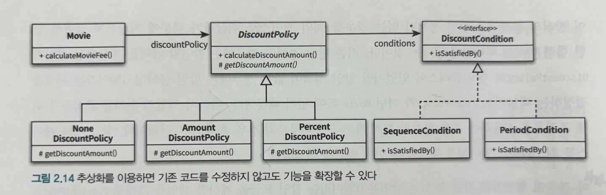

### 추상 클래스와 인터페이스 트레이드 오프

NoneDiscountPolicy의 코드를 자세히 보면 getDiscountAmount() 메서드가 어떤 값을 반환하더라도 상관이 없다는 것을 알 수 있다. DiscountPolicy의 calculateDiscountAmount() 메서드 구현에서 discountConditions 가 없다면 무조건 Money.ZERO 를 반환하고 있기 때문이다. 이런 사실 때문에 NoneDiscountPolicy는 구색만 맞추고 있을 뿐 실질적인 협력은 제대로 하고 있지 않다.

위 상황에 대한 해결방법

- DiscountPolicy를 인터페이스로 변경
- NoneDiscountPolicy가 DiscountPolicy의 getDiscountAmount() 메서드가 아닌 calculateDiscountAmount() 오퍼레이션을 오버라이딩하도록 변경

```ts
interface DiscountPolicy {
  calculateDiscountAmount(screening: Screening): Money;
}

abstract class DefaultDiscountPolicy implements DiscountPolicy {
  /* 생략 */
}

class NoneDiscountPolicy implements DiscountPolicy {
  calculateDiscountAmount(screening: Screening): Money {
    return Money.ZERO;
  }
}
```

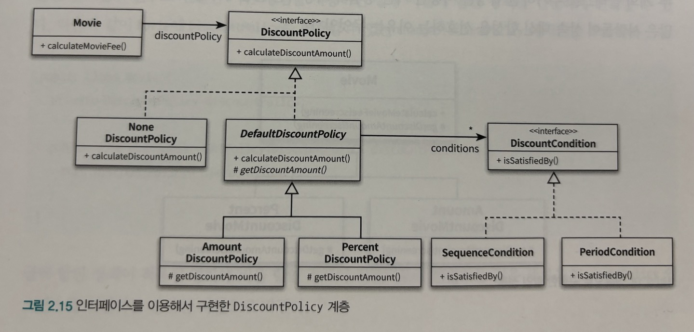

현실적으로는 NoneDiscountPolicy만을 위해 인터페이스를 추가하는 것이 과하다는 생각이 들 수도 있을 것이다.

_구현과 관련된 모든 것들이 트레이드오프의 대상이 될 수 있다._

여러분이 작성하는 모든 코드에는 합당한 이유가 있어야 한다. 비록 아주 사소한 결정이더라도 트레이드 오프를 통해 얻어진 결론과 그렇지 않은 결론 사이의 차이는 크다. 고민하고 트레이드오프하라.

### 코드 재사용

합성(composition)이란?

- 다른 객체의 인스턴스를 자신의 인스턴스 변수로 포함해서 재사용하는 방법

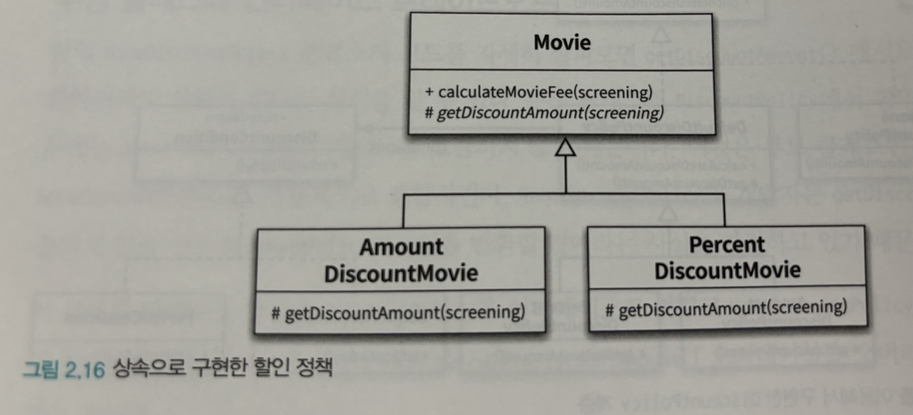

### 상속

객체지향에서 코드를 재사용하기 위해 널리 사용되는 기법이다.

하지만 두 가지 관점에서 설계에 안 좋은 영향을 미친다.

1. `캡슐화 위반`(가장 큰 문제)
2. 유연하지 못한 설계로 만듬

부모 클래스의 구현이 자식 클래스에게 노출되기 때문에 캡슐화가 약화된다. 캡슐화의 약화는 자식 클래스가 부모 클래스에 강하게 결합되도록 만들기 때문에 부모 클래스를 변경할 때 자식 클래스도 함께 변경될 확률을 높인다. 결과적으로 상속을 과도하게 사용한 코드는 변경하기도 어려워진다.

_상속은 부모 클래스와 자식 클래스 사이의 관계를 컴파일 시점에 결정한다. 따라서 실행 시점에 객체의 종류를 변경하는 것이 불가능하다._

예를 들어, 실행 시점에 금액 할인 정책인 영화를 비율 할인 정책을 변경한다고 가정하자. 상속을 사용한 설계에서는 AmountDiscountMoive의 인스턴스를 PercentDicountMovie의 인스턴스로 변경해야 한다.

반면 인스턴스 변수로 연결한 기존 방법을 사용하면 실행 시점에 할인 정책을 간단하게 변경할 수 있다.

```ts
class Movie {
  private _discountPolicy: DiscountPolicy;

  changeDiscountPolicy(discountPolicy: DiscountPolicy) {
    this._discountPolicy = discountPolicy;
  }
}

const avatar: Movie = new Movie(
  "아바타",
  120,
  Money.wons(10000),
  new AmountDiscountPolicy(Money.wons(800) /* 생략 */)
);

avatar.changeDiscountPolicy(new PercentDiscountPolicy(0.1));
```

### 합성

인터페이스에 정의된 메시지를 통해서만 코드를 재사용하는 방법

- 실제로 Movie는 DiscountPolicy가 외부에 calculateDiscountAmount 메서드를 제공한다는 사실만 알고 내부 구현에 대해서는 전혀 알지 못한다.

합성은 상속이 가지는 두 가지 문제점을 모두 해결한다.

1. 인터페이스에 정의된 메시지를 통해서만 재사용이 가능하기 때문에 구현을 효과적으로 캡슐화 함
2. 의존하는 인스턴스를 교체하는 것이 비교적 쉽기 때문에 설계를 유연하게 만듬
