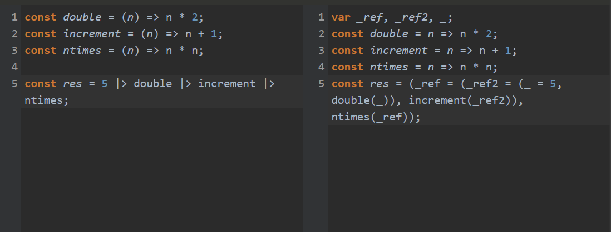

# 7. 컴포지션과 파이프라인

## 일반적인 용어에서의 컴포지션

### 유닉스 철학

유닉스 철학의 일부분

> 각 프로그래밍이 **한가지 작업**을 잘하게 하라. 새로운 작업을 하려면 새로운 '기능'을 추가해 오래된 프로그램을 복잡하게 하지말고 새로 만들어라

- 함수를 구성할 때 정확히 위 철학을 따라야 한다.

> 모든 프로그램의 출력이 아직 알려지지 않은 다른 프로그램의 입력이 될 것으로 예상한다.

문장을 이해하기 위한 유닉스 명령어를 활용 한 예시

```bash
echo "hi there?" > composition.txt
cat composition.txt | grep 'there' # unix pipe
```

- 이 명령어에서 `cat` 의 출력은 `grep` 의 입력으로 사용된다. 파이프를 이용해 두 `기본 함수`를 엮어 새로운 함수를 생성했다. 여기서 파이프(`|`) 는 주어진 두 명령어를 연결하는 bridge 역할을 한다.
  - 여기서 `기본 함수` 는 인자를 취하고 값을 반환해야 한다.

### 함수형 컴포지션

5장의 map과 filter를 활용한 apressBooks 예시

```ts
type Review = {
  good?: number;
  excellent?: number;
};

type Book = {
  id: number;
  title: string;
  author: string;
  rating: number[];
  reviews: Review[];
};

const apressBooks: Book[] = [
  {
    id: 111,
    title: "C# 6.0",
    author: "Andrew Troelsen",
    rating: [4.7],
    reviews: [{ good: 4, excellent: 12 }],
  },
  {
    id: 222,
    title: "Efficient Learning Machines",
    author: "Rahul Khanna",
    rating: [4.5],
    reviews: [],
  },
  {
    id: 333,
    title: "Pro AngularJS",
    author: "Adam Freeman",
    rating: [4.0],
    reviews: [],
  },
  {
    id: 444,
    title: "Pro ASP.NET",
    author: "Adam Freeman",
    rating: [4.2],
    reviews: [{ good: 14, excellent: 12 }],
  },
];

// rating 값이 4.5 이상인 객체에서 title, author 뽑아내기
const res = map(
  filter(apressBooks, (book) => book.rating[0] > 4.5),
  (book) => {
    return { title: book.title, author: book.author };
  }
);
```

- 위의 문제를 해결할 때 filter의 **출력** 이 map의 **입력**으로 전달된다. 앞의 예시의 파이프의 동작과 유사하다고 볼 수 있다.

### compose 함수

#### 간단한 compose 함수 구현

단일 인자를 받는 두 함수를 입력으로 받는 compose 함수

```ts
const compose =
  <T, U, V>(a: (arg: U) => V, b: (arg: T) => U) =>
  (c: T) =>
    a(b(c));
```

#### 예시 1

```ts
const toInt = compose(Math.round, parseFloat);

console.log(toInt("3.54234235234")); // 4
```

- 위 코드에서 `toInt` 는 `Math.round` 와 `parseFloat` 를 compose로 구성해 새로운 함수를 구현했다.

#### 예시 2

```ts
const splitIntoSpaces = (str: string) => str.split(" ");
const count = (arr: string[]) => arr.length;

const countWords = compose(count, splitIntoSpaces);

console.log(countWords("hello world hi there")); // 4
```

- 공백문자로 문자열을 자르는 함수(`splitIntoSpaces`) 와 문자열 배열의 길이를 반환하는 함수(`count`)를 compose로 구성해 글자수를 세는 새로운 함수를 쉽게 만들었다.

### curry, partial을 이용해 다항 함수 합성하기

위의 apressBooks 문제의 해결을 위해 map과 filter를 사용했다. map과 filter는 둘 다 다항 함수이다. 이를 curry 와 partial을 이용해 단항 함수로 변경하고, compose를 구성해 같은 문제를 해결하고자 한다.

#### rating을 기반으로하는 필터링 함수들

```ts
const filterOutStandingBooks: Predicate<Book> = (book) => book.rating[0] === 5;
const filterGoodBooks: Predicate<Book> = (book) => book.rating[0] > 4.5;
const filterBadBooks: Predicate<Book> = (book) => book.rating[0] < 3.5;
```

#### 프로젝션 함수들

```ts
export type Project<T, U> = (item: T) => U;
const projectTitleAndAuthor: Project<Book, Pick<Book, "title" | "author">> = (
  book
) => ({
  title: book.title,
  author: book.author,
});

const projectTitle: Project<Book, Pick<Book, "title">> = (book) => ({
  title: book.title,
});

const projectAuthor: Project<Book, Pick<Book, "author">> = (book) => ({
  author: book.author,
});
```

> 간단한 작업에 작은 함수들을 굳이 왜 재선언 할까? 컴포지션은 작은 함수가 큰 함수로 구성되는 것이다. **간단한 함수는 읽고, 테스트하고 유지하기 쉽다.** 그리고 compose를 사용해 함수들을 재사용해서 다양한 부분들을 구현할 수 있다.

#### apressBooks 문제(_rating 값이 4.5 이상인 객체에서 title, author 뽑아내기_) 해결하기

```ts
const queryGoodBooks = partial(filter, undefined, filterGoodBooks);
const mapTitleAndAuthor = partial(map, undefined, projectTitleAndAuthor);
const titleAndAuthorForGoodBooks = compose(mapTitleAndAuthor, queryGoodBooks);

console.log(titleAndAuthorForGoodBooks(apressBooks));
```

### 여러 함수 합성

```ts
// 5장의 reduce에서 제네릭 타입 수정
const reduce = <T, I, U>(
  arr: T[],
  callback: (acc: I, value: T, index: number, array: T[]) => U,
  initialValue?: I
): U => {
  let acc = initialValue === undefined ? (arr[0] as any) : initialValue;

  for (let i = initialValue === undefined ? 1 : 0; i < arr.length; i++)
    acc = callback(acc, arr[i], i, arr);

  return acc;
};

// 여러 함수를 합성하는 composeN
export const composeN =
  <T, R>(...fns: Function[]) =>
  (arg: T) =>
    // 함수 배열을 뒤집어서 인자로 받은 함수를 역순으로 실행한다.
    reduce<Function, T, R>(fns.reverse(), (acc, fn) => fn(acc), arg);
```

#### apressBooks 문제 composeN으로 해결하기

```ts
const titleAndAuthorForGoodBooks = composeN<
  Book[],
  Pick<Book, "title" | "author">
>(mapTitleAndAuthor, queryGoodBooks);
```

#### 단어 수 세기 문제 composeN으로 해결하기

```ts
const splitIntoSpaces = (str: string) => str.split(" ");
const count = (arr: string[]) => arr.length;

const countWords = composeN<string, number>(count, splitIntoSpaces);

console.log(countWords("함수형 자바스크립트 입문")); // 3
```

#### 주어진 문장의 단어의 개수가 홀수인지 짝수인지 판별하기

```ts
const oddOrEven = (num: number) => (num % 2 === 0 ? "even" : "odd");

const oddOrEvenWords = composeN<string, "even" | "odd">(
  oddOrEven,
  count,
  splitIntoSpaces
);

console.log(oddOrEvenWords("함수형 자바스크립트 입문")); // odd
```

## 파이프라인과 시퀀스

composeN은 인자로 주어진 배열을 뒤집어서 가장 마지막에 전달된 함수가 먼저 실행된다. 즉 데이터 플로우는 오른쪽에서 왼쪽이다.

유닉스 파이프 (`|`) 예제에서 데이터 플로우는 왼쪽에서 오른쪽이다.

이 절에서 구현할 pipe는 compose와 반대 방향을 가지는 (왼쪽에서 오른쪽) 함수이다.

> 데이터를 왼쪽 -> 오른쪽 이동하는 과정을 파이프라인 혹은 짝수 시퀀스(또는 시퀀스) 라고 부른다.

```ts
interface IPipe {
  <A>(value: A): A;

  <A>(...value: A[]): A;

  <A, B>(value: A, fn1: (input: A) => B): B;

  <A, B, C>(value: A, fn1: (input: A) => B, fn2: (input: B) => C): C;

  <A, B, C, D>(
    value: A,
    fn1: (input: A) => B,
    fn2: (input: B) => C,
    fn3: (input: C) => D
  ): D;

  <A, B, C, D, E>(
    value: A,
    fn1: (input: A) => B,
    fn2: (input: B) => C,
    fn3: (input: C) => D,
    fn4: (input: D) => E
  ): E;
  // ... and so on
}

export const pipe: IPipe =
  (...fns: Function[]): unknown =>
  (...value: unknown[]) => {
    return fns.reduce((acc, fn) => [fn(...acc)], value)[0];
  };
```

※ composeN도 위처럼 구현하는게 더 엄격한 타입을 가지지만 pipe만 타입을 적용했음

- 함수 인자들을 동적으로 받기 때문에 함수의 타입들을 위의 `IPipe` 처럼 가능한 경우의 수들을 직접 선언해줘야 함
- 비슷한 기능을 하는 [rxjs의 pipe 함수 선언 예시](https://github.com/ReactiveX/rxjs/blob/master/packages/rxjs/src/internal/util/pipe.ts)

코드에서 `pipe` 나 `compose` 를 사용할 수 있지만, 협업 시 두 함수를 함께 사용한다면 혼란에 빠질 수 있으므로 한 프로젝트에서는 하나만 사용하는 것을 권장

일반적으로 shell script에 익숙하면 `compose` 보다는 `pipe` 를 선호

### 컴포지션의 특이점

#### 컴포지션은 결합 법칙이 성립한다.

수학에서의 결합법칙

```
x * (y * z) = (x * y) * z = xyz
```

compose의 결합법칙

```
compose(f, compose(g, h)) === compose(compose(f, g), h)
```

※ 책에서 모든 함수를 순수 함수로 가정해서 일부러 뺀건지 모르겠지만 합성하는 함수들이 순수함수가 아닌 경우에(사이드 이펙트가 있는 경우) 결합 법칙은 성립하지 않는다.

위의 예제 oddOrEvenWord 를 사용한 결합 법칙 예시

```ts
// compose(compose(f, g), h);
const oddOrEvenWords = compose(compose(oddOrEven, count), splitIntoSpaces);

// compose(f, compose(g, h));
const oddOrEvenWords2 = compose(oddOrEven, compose(count, splitIntoSpaces));

console.log(
  oddOrEvenWords("함수형 자바스크립트 입문") ===
    oddOrEvenWords2("함수형 자바스크립트 입문")
); // true
```

compose를 이용해 작은 함수들을 조합해서 필요 케이스에 따라 그룹화해서 사용할 수 있다.

### 파이프라인 연산자

※ 이 절에서 설명하는 파이프라인 연산자(`|>`)는 JS(TS) 의 실제 연산자는 아니고 [드래프트 상태](https://github.com/tc39/proposal-pipeline-operator)

```ts
const double = (n: number) : number => n * 2;
const increment = (n : number) : number => n + 1;
const ntimes = (n: number) : number => n * n;

const res = 5 |> double |> increment |> ntimes;
```

제안 상태인 파이프라인 연산자(`|>`) 는 좌변을 평가해 우변에 좌변의 값을 단항 함수 호출로 적용한다.

온라인 [bebel repl](https://babeljs.io/repl)에서 파이프라인 연산자 트랜스파일을 테스트할 수 있다.



### tap 함수를 사용한 디버깅

- 여러 함수를 합성해서 사용하면 에러가 발생했을 때 중간 값을 확인해야할 필요가 있을 때가 있다. 이때 tap을 이용하면 쉽게 디버깅을 할 수 있다.

```ts
// 참고:  4장에서 tap 구현이랑 파라미터 순서가 다름
const tap =
  <T>(fn: (x: T) => void) =>
  (x: T) => {
    fn(x);
    return x;
  };

const operation = pipe(
  add,
  tap((x) => console.log("add res :", x)),
  square,
  tap((x) => console.log("square res :", x)),
  double
);

/**
 * add res : 4
 * square res : 16
 * 32
 */
console.log(operation(2, 2));
```
