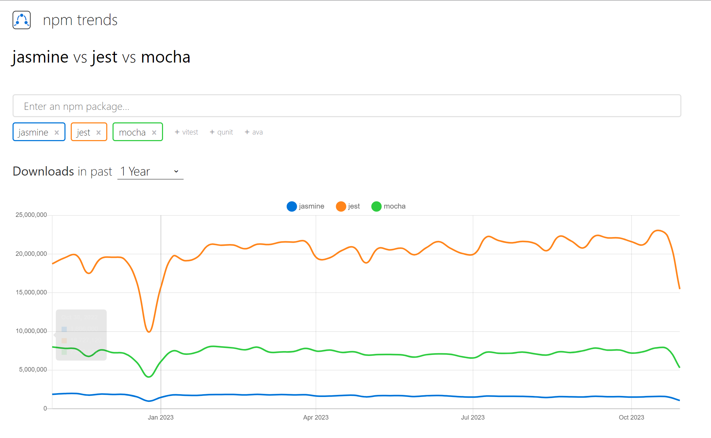

# 테스트와 마무리

## 테스팅의 종류

중요한 테스트 종류는 다음과 같다

- 단위 테스트(unit test)
  - 모든 함수를 독립적으로 테스트하려고 단위 테스트를 작성한다.
  - 단위 테스트는 입력을 제공해 원하는 출력과 일치하는지 확인해 개별적인 함수를 테스트한다.
  - 단위 테스트는 의존적인 동작을 모킹(mock) 한다.
- 통합 테스트 (integration test)
  - 통합 테스트는 엔드 투 엔드(E2E) 함수성을 테스트하고자 작성된다.
  - 예를 들어 사용자 등록 시나리오에서 통합 테스트는 데이터 저장소에서 사용자를 생성하고 존재하는지 확인한다.
- UI (함수형) 테스트
  - UI 테스트는 웹 애플리케이션을 위한 것이다.
  - 브라우저를 제어하고 사용자 시나리오를 확인하고자 작성된다.

기타 테스트로는 스모크 테스트, 회귀 테스트, 인수 테스트, 시스템 테스트, 모의 테스트, 침투 테스트, 성능 테스트 등이 있다.

본 챕터에서는 단위 테스트 만을 집중적으로 다룬다.

## 자바스크립트 테스트 프레임워크

- JS 테스트 프레임워크로는 Mocha, Jest, Jasmine, Cucumber 등 다양한 테스트 프레임워크가 있다.
  

  - 책에서는 jasmine이 가장 유명하다고 하는데, 현 시점 npm trend에서는 jest가 압도적이다
  - jest 자체가 facebook에서 react 프로젝트 테스팅을 위해 개발됐고, react의 대부분의 보일러플레이트에 기본적으로 탑재되어있다.
  - nestjs 의 보일러플레이트에도 기본적으로 유닛테스트 라이브러리는 jest이다.

> 해당 챕터에서는 mocha를 사용한다.

### Mocha를 사용한 테스팅

- mocha 는 기본적으로 assertion 라이브러리가 없기 때문에 추가적으로 assertion 라이브러리를 설치해야한다. 여기서는 chai 를 사용한다.

- 프로젝트 세팅에 대한 설명은 생략, 해당 프로젝트의 package.json 참고

#### 테스트 대상 함수 작성

```ts
// index.ts
export function sum(x: number, y: number) {
  return x + y;
}
```

#### 테스트 작성

```ts
// test/index.spec.ts
import { assert } from "chai";
import { sum } from "..";

describe("first test", () => {
  it("should be true", () => {
    assert.equal(sum(1, 2), 3);
  });
});
```

- describe의 첫번째 인자는 테스트 유형에 대한 설명한다
  - 하나의 테스트 유형에는 여러 행동들이 있을 수 있다. 즉 하나의 describe 블럭에는 여러 it 블럭이 존재할 수 있다.
- it의 첫번째 인자는 실제 테스트에서 원하는 행동을 설명한다

#### 실행 응답

- 실행

```bash
yarn test
```

- 응답

```bash

  first test
    ✔ should be true


  1 passing (2ms)
```

### 커링 테스트

먼저 테스트 대상(커링)에 대한 주요한 특성 세트를 목록화 하자

1. curryN은 항상 함수를 반환해야 한다.
2. curryN은 함수만 받아 들여야 하며, 다른 값을 전달하면 에러를 발생시킨다.
3. curryN 함수는 동일한 개수의 인자로 호출될 때 일반 함수의 동일한 값을 반환해야 한다.

#### 위 시나리오의 테스트 코드

```ts
it("should return a function", () => {
  const curried = curryN(sum);
  assert.isFunction(curried);
});

it("should throw if a function is not provided", () => {
  assert.throws(curryN as any, Error);
});

it("calling curried function and original function with same arguments should return same result", () => {
  const curried = curryN(sum);
  assert.equal(curried(1, 2), sum(1, 2));
  assert.equal(curried(1)(2), sum(1, 2));
});
```

### 함수자 테스트

함수자 특성 세트

1. 함수자는 값을 보유하는 컨테이너다
2. 함수자는 함수 매핑을 구현하는 일반적인 객체이다.
3. MayBe와 같은 함수자는 null이나 undefined를 처리해야한다.
4. MayBe와 같은 함수자는 map을 체이닝할 수 있어야한다.

#### 테스트 코드

```ts
it("should store a value", () => {
  const container = Container.of(1);
  assert.equal(container.value, 1);
});

it("should implement map", () => {
  const container = Container.of(1);
  assert.equal(typeof container.map, "function");

  const received = container.map((x) => x + 1);
  assert.equal(received.value, 2);
});
```

### Mocha를 사용한 비동기 테스트

```ts
it("Promise should resolve", async () => {
  const promise = new Promise((resolve) => {
    setTimeout(() => {
      resolve("resolved");
    }, 1000);
  });

  const result = await promise;
  assert.equal(result, "resolved");
});
```

위의 테스트를 전부 실행한 콘솔 결과는 아래와 같다

```bash

  first test
    ✔ should be true

  curryN
    ✔ should  return a function
    ✔ should throw if a function is not provided
    ✔ calling curried function and original function with same arguments should return same result

  Functor
    ✔ should store a value
    ✔ should implement map

  asynchronous code
    ✔ Promise should resolve (1003ms)


  7 passing (1s)
```

## Sinon을 사용한 모의 테스트

여러 의존성을 가진 코드를 테스트할 때 `mock`, `spy`, `stub` 등을 사용해서 테스트해야할 때가 있다.
sinon을 사용하여 문제를 해결할 수 있다.

> mock, spy, stub 은 테스트 코드에서 중요한 개념이지만, 테스트에 대한 내용이 매우 방대하므로 여기서 설명하지는 않는다.

[관련 아티클](https://besfir.github.io/ko/blog/2023/06/find-out-spy-stub-fake-mock)

### fake 테스트

```ts
it("fake test", () => {
  const testObject = {
    doSomething: (callback: Function) => {
      const x = 1;
      return callback(x);
    },
  };

  const fake = Sinon.fake();
  testObject.doSomething(fake);
  assert(fake.calledWith(1));
});
```

위 코드를 보면 실제로 callback으로 전달할 함수를 만들지 않았다. 대신 sinon의 fake를 이용해 함수를 모방해서 전달하고, callback으로 전달한 함수가 호출됨을 보장하는지 테스트한다.

### stub 테스트

```ts
it("Stub test", () => {
  const testObject = {
    tenTimes: (x: number) => x * 10,
  };

  const fakeFunction = Sinon.stub(testObject, "tenTimes");
  fakeFunction.withArgs(10).returns(100);

  const received = testObject.tenTimes(10);

  assert.equal(received, 100);
});
```

스텁은 함수의 동작자체를 정의하는데 사용한다.

### mock 테스트

```ts
it("mock test", async () => {
  const httpClient = {
    get: async (url: string) => {
      return await fetch(url);
    },

    getOne: async (url: string) => {
      try {
        const response = await httpClient.get(url);
        return response.json();
      } catch (error) {
        return Promise.reject(error);
      }
    },
  };

  const mock = Sinon.mock(httpClient);
  mock
    .expects("get")
    .once()
    .withArgs("https://jsonplaceholder.typicode.com/todos/1")
    .returns(
      Promise.resolve({
        json: () => Promise.resolve({ id: 1, title: "delectus aut autem" }),
      })
    );

  const received = await httpClient.getOne(
    "https://jsonplaceholder.typicode.com/todos/1"
  );

  assert.deepEqual(received, { id: 1, title: "delectus aut autem" });
});
```

mock 테스트는 위의 httpClient에서 http 요청을 실제로 호출하는 코드를 mocking 한다. 이 방법으로 다른 팀에서 개발 중인 api가 완료되지 않아도 개발을 진행할 수 있다.

### 커버리지

테스트 커버리지란 소프트웨어에 대해 충분히 테스트가 되었는지 나타내는 정도이다.

코드 커버리지란 테스트에 의해 실행된 소스 코드의 양을 의미한다. 즉 테스트로 코드가 얼마나 covered 됐는지 나타내는 정도이다.

#### 코드 커버리지의 측정 기준

- 함수 커버리지
  - 어떤 함수가 최소 1번 이상 호출되었는지를 기준으로 커버리지를 계산한다. 함수 내부의 모든 코드가 실행되었는지는 판단 기준에서 제외한다.

```ts
function a(): void {}

function b(): void {}

function c(): void {}

function d(): void {}
```

위와 같이 4개의 함수가 있고, 테스트 코드가 a() 와 b() 만 실행한다면, 4 개 중 2개의 함수를 실행하여 테스트 커버리지는 50% 이다.

> 함수 커버리지 = (실행된 함수의 수 / 전체 함수의 수 ) \* 100

- 구문 (Statement) 커버리지
  - 라인(Line) 커버리지 라고도 불리며, 프로덕션 코드의 전체 구문 중 몇 줄의 구문이 실행되었는지를 기준으로 한다.

```ts
function func(a: number) {
  console.log("func start"); // (1)
  if (a > 10)
    // (2)
    console.log(a); // (3)
  console.log("func end"); // (4)
}
```

위 코드를 테스트할 때 a가 10보다 작은 경우에 대해서만 테스트 한 경우 (3) line은 테스트에서 실행되지 않는다. 이 경우 4개의 구문 중 3개만 실행됐으므로 커버리지는 75% 이다.

> 구문 커버리지 = (실행된 구문의 수 / 전체 구문의 수) \* 100

- 결정 (Decision) 커버리지

  - 브랜치 (Branch) 커버리지 라고도 한다. 프로덕션 코드에 조건문이 있는 경우 조건문의 전체 조건식이 참인 케이스, 거짓인 케이스 2가지가 최소 한번씩 실행되면 충족된다. 개별 조건식의 개수와는 상관없이 2개의 테스트 케이스로 충족이 가능하다.

- 조건 (Condition) 커버리지

  - 조건 커버리지는 결정 커버리지와 다르게 전체 조건식이 아니라 개별 조건식을 기준으로 판단한다. 테스트 대상의 개별 조건식이 모두 참 거짓을 한번씩 가지도록 하면 조건 커버리지를 충족한다.

- 조건 / 결정 (Condition / Decision) 커버리지
  - 조건 커버리지와 결정 커버리지를 모두 만족할 때 충족되는 조건

**※ 커버리지에 대하여...**

> 클린 코드에서는 모든 코드에 대해 테스트 커버리지 100%를 요구한다. 작성한 코드를 모두 테스트하여야 한다고 한다. 하지만 블라디미르 코리코프의 unit testing 책을 보면 테스트 커버리지는 중요한 지표지만 이 지표만을 좋은 테스트의 조건으로 삼을 경우 좋은 테스트 코드가 작성이 되지 않을 수 있다고 한다. 커버리지만을 높이기 위해 리팩토링 내성이 깨지기 쉽기 때문이다. 또한 커버리지만을 높이기 위해 중요하지 않은 코드까지 테스트 대상에 포함되는 경우 개발자가 테스트 코드에 지칠 확률이 높고 결국 중요한 코드에 대해 테스트 코드를 작성하지 않게 될 수도 있다. 결론적으로 테스트 커버리지는 중요한 지표이지만 이외의 다른 테스트 코드 지표들과 균형을 잘 맞추는게 중요하다.

> ※ 책에서는 이후 jasmine을 통한 테스팅, eslint 등을 다루나 대부분 기본적인 내용이므로 리뷰하지 않았다.
